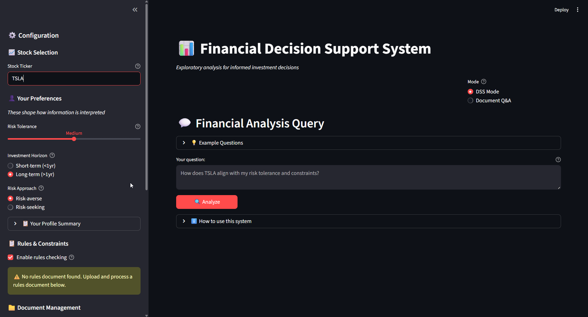
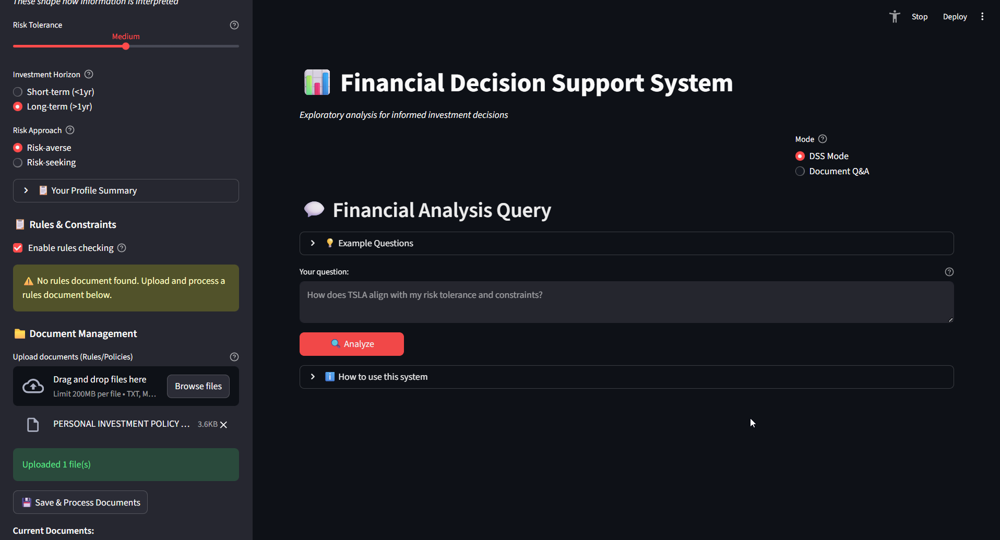
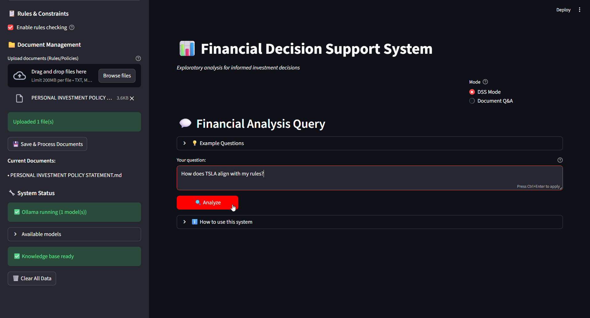
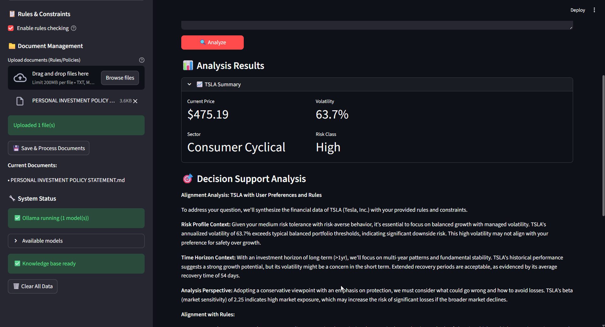
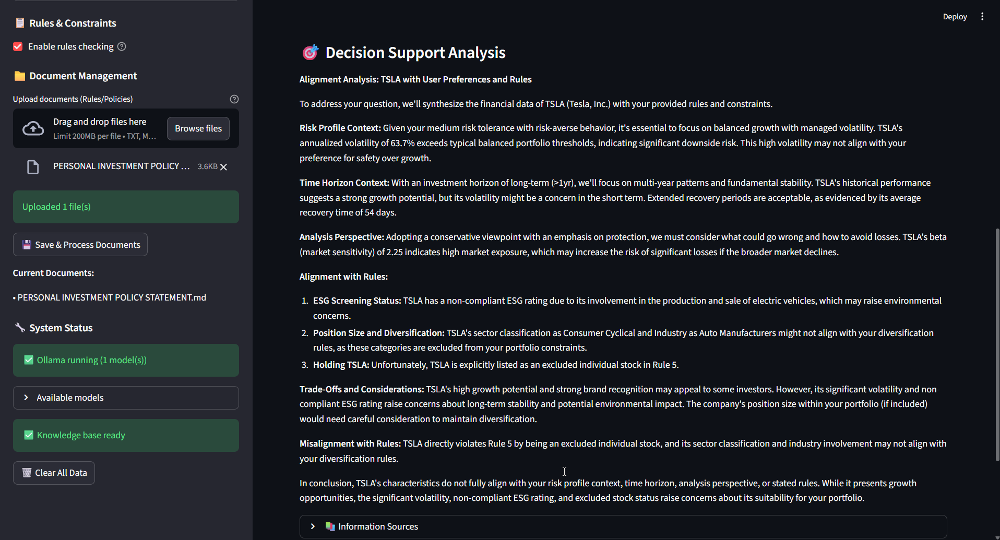
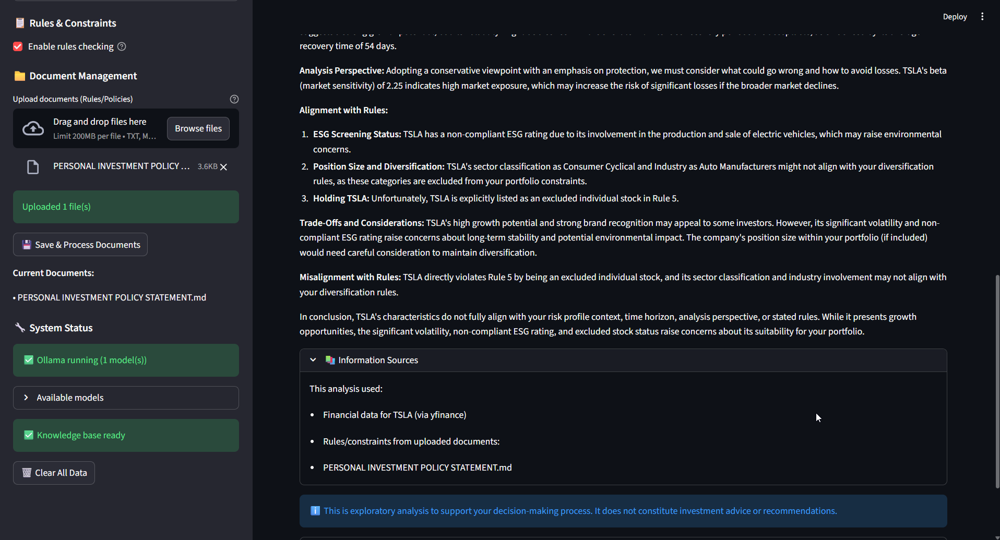

# 📊 Financial Decision Support System (DSS)

An exploratory decision support system for financial analysis that helps users understand investment characteristics through preference-driven analysis. Built on a local-first RAG architecture using Streamlit, LangChain, ChromaDB, and Ollama.


## 📸 System Demo


*Complete workflow: Stock selection → Preference configuration → Rules upload → Analysis query → Results display*

## 🎯 Project Overview

This system extends a general-purpose RAG application into a specialized **exploratory decision support system** for financial decision-making, providing preference-driven analysis while maintaining strict neutrality.

### What This System Does

✅ **Exploratory Analysis**: Provides structured insights to help understand investment characteristics  
✅ **Preference-Driven Interpretation**: Shapes analysis based on risk tolerance, time horizon, and risk behavior  
✅ **Constraint Checking**: Highlights alignment/misalignment with uploaded rules documents  
✅ **Trade-off Explanation**: Presents considerations without making recommendations  
✅ **Transparent Sources**: Cites financial data and rule sources  

### What This System Does NOT Do

❌ **No Recommendations**: Never suggests "buy", "sell", or "hold"  
❌ **No Predictions**: Treats historical data as contextual evidence, not forecasts  
❌ **No Decision-Making**: Leaves final decisions to the user  
❌ **No Investment Advice**: Acts as an analyst, not an advisor  

## 🏗️ System Architecture

```
┌─────────────────────────────────────────────────────────────┐
│                    USER INTERFACE LAYER                      │
│         (app.py - Streamlit with preference controls)        │
└──────────────────┬──────────────────────────────────────────┘
                   │
┌──────────────────▼──────────────────────────────────────────┐
│              PREFERENCE TRANSLATION LAYER                    │
│         (preference_engine.py - Context modulation)          │
└──────────────────┬──────────────────────────────────────────┘
                   │
┌──────────────────▼──────────────────────────────────────────┐
│                  DATA INTEGRATION LAYER                      │
│  ┌──────────────┐  ┌─────────────────┐  ┌─────────────────┐│
│  │ Stock Data   │  │ Rules Document  │  │ User Context    ││
│  │ (yfinance)   │  │ (optional)      │  │ (preferences)   ││
│  └──────────────┘  └─────────────────┘  └─────────────────┘│
│         financial_data.py      ChromaDB                      │
└──────────────────┬──────────────────────────────────────────┘
                   │
┌──────────────────▼──────────────────────────────────────────┐
│            REASONING & EXPLANATION LAYER                     │
│    (query_data_dss.py - Ollama LLM with DSS prompting)      │
└──────────────────┬──────────────────────────────────────────┘
                   │
┌──────────────────▼──────────────────────────────────────────┐
│                 PRESENTATION LAYER                           │
│          (Streamlit UI with structured output)               │
└─────────────────────────────────────────────────────────────┘
```

## ✨ Key Features

### 1. **Dual-Mode Operation**
- **DSS Mode**: Financial analysis with stock data and preference-driven interpretation
- **Document Q&A Mode**: Original RAG functionality for general document questions

### 2. **Preference-Driven Analysis**
User preferences actively shape how information is interpreted:
- **Risk Tolerance** (Low/Medium/High): Affects volatility framing
- **Time Horizon** (Short/Long-term): Determines relevant data focus
- **Risk Behavior** (Averse/Seeking): Modulates opportunity vs. risk emphasis

**Example**: Same 25% volatility
- Risk-averse user: "Substantial downside risk requiring consideration"
- Risk-seeking user: "Significant return potential during favorable conditions"

### 3. **Optional Rules Integration**
- Upload investment policy documents (PDF, DOCX, TXT)
- System flags alignment/misalignment with stated constraints
- Works correctly with or without rules documents

### 4. **Financial Data Summarization**
- Fetches real-time data via yfinance
- Computes risk metrics (volatility, drawdown, beta)
- Analyzes trends and performance
- Pre-processes data before LLM context injection

### 5. **Local-First & Privacy-Focused**
- All processing happens locally (no external APIs)
- Ollama for primary LLM inference
- Local embeddings with sentence-transformers
- ChromaDB for vector storage

## 🚀 Quick Start

### Prerequisites

- Python 3.8 or higher
- Git
- Ollama (recommended for best results)

### Installation

1. **Clone the repository**
   ```bash
   git clone <your-repo-url>
   cd financial-dss
   ```

2. **Create virtual environment**
   ```bash
   python -m venv venv
   
   # On Windows
   venv\Scripts\activate
   
   # On macOS/Linux
   source venv/bin/activate
   ```

3. **Install dependencies**
   ```bash
   pip install -r requirements.txt
   ```

4. **Install and setup Ollama** (recommended)
   ```bash
   # Visit ollama.ai to download for your OS
   # Then pull a model:
   ollama pull llama3.2
   ```

5. **Run the application**
   ```bash
   streamlit run app.py
   ```

The app will open at `http://localhost:8501`

## 📖 Usage Guide

### DSS Mode (Financial Analysis)

#### Step 1: Configure Your Preferences

*Set your stock ticker and preference profile (risk tolerance, time horizon, behavior)*

#### Step 2: Upload Investment Rules (Optional)

*Upload your investment policy document for constraint checking*

#### Step 3: Ask Your Question

*Enter questions about alignment, trade-offs, or characteristics*

#### Step 4: Review Analysis Results

*Stock summary with key metrics and risk classification*


*Preference-driven decision support analysis*


*Transparent source attribution for all information used*

### Document Q&A Mode (Original RAG)

1. **Configure Preferences** (sidebar):
   - Set risk tolerance: Low/Medium/High
   - Choose time horizon: Short-term/Long-term
   - Select risk behavior: Risk-averse/Risk-seeking

2. **Enter Stock Ticker**: E.g., AAPL, MSFT, TSLA

3. **Optional: Upload Rules Document**:
   - Upload investment policy or personal constraints
   - Enable "rules checking" to flag alignments

4. **Ask Questions**:
   - "How does this stock align with my risk tolerance?"
   - "What are the key risk considerations given my preferences?"
   - "Does this stock match my stated constraints?"

5. **Review Analysis**:
   - Stock summary with key metrics
   - Preference-driven interpretation
   - Trade-off explanations
   - Source citations

### Document Q&A Mode (Original RAG)

1. Upload documents (PDF, DOCX, TXT, MD)
2. Click "Save & Process Documents"
3. Ask questions about document content
4. Get AI-generated answers with sources

## 🔧 Project Structure

```
Financial-Decision-Support-System/
├── app.py                        # Streamlit UI (enhanced with DSS features)
├── query_data_dss.py             # Enhanced RAG with DSS logic
├── financial_data.py             # Stock data fetching & summarization
├── preference_engine.py          # Preference translation & context generation
├── create_database.py            # Vector database creation
├── document_loader.py            # Document ingestion (unchanged)
├── requirements.txt              # Dependencies
├── README.md                     # This file
├── LICENSE                       # GPL-3.0 license
├── assets/                       # Visual assets
│   ├── screenshots/
│   │   ├── 01_initial_screen.png
│   │   ├── 02_rules_upload.png
│   │   ├── 03_query_input.png
│   │   ├── 04_analysis_results_part1.png
│   │   ├── 05_analysis_results_part2.png
│   │   └── 06_sources_display.png
│   └── demo/
│       └── full_workflow.gif
├── examples/                     # Example files
│   └── PERSONAL INVESTMENT POLICY STATEMENT.md
├── data/                         # Created at runtime
│   └── docs/                     # Uploaded documents (auto-created)
└── chroma/                       # Vector database storage (auto-created)
```

## 🧠 How Preferences Shape Analysis

### Design Philosophy

Preferences are not simply metadata appended to queries. They actively shape how the system interprets and presents information through sophisticated context modulation.

1. **Interpretive Context Generation**: Maps preferences → interpretive frameworks
2. **Prompt Engineering**: Injects preference-specific guidance into system prompts
3. **Metric Interpretation**: Same numbers, different contextual framing

### Example: Volatility Interpretation

**Stock X has 25% annualized volatility**

| User Profile | System Interpretation |
|--------------|----------------------|
| Low risk tolerance, Risk-averse | "This moderate-to-high volatility suggests price swings that may exceed comfort thresholds for capital preservation" |
| High risk tolerance, Risk-seeking | "This volatility provides meaningful opportunity for returns during favorable market phases" |
| Medium risk tolerance, Long-term | "This volatility is typical for balanced growth strategies with multi-year horizons" |

## 📊 Example Interactions

### Example 1: Risk Alignment Query

**User Setup**:
- Ticker: TSLA
- Risk Tolerance: Low
- Time Horizon: Long-term
- Risk Behavior: Risk-averse

**Query**: "How does Tesla align with my risk tolerance?"

**System Response** (excerpt):
```
Tesla (TSLA) exhibits 42% annualized volatility, positioning it in 
the high-risk category. For conservative portfolios focused on capital 
preservation, this represents substantial price fluctuation risk...

Maximum drawdown of 31% was observed during the analysis period, 
indicating potential for significant capital loss during market downturns. 
Recovery periods averaged 94 days...

MISALIGNMENT ASSESSMENT: Tesla's risk characteristics exceed typical 
conservative portfolio guidelines. The high volatility and substantial 
drawdown history conflict with low risk tolerance preferences.
```

### Example 2: Rules Constraint Checking

**Rules Document Content**:
```
Investment Policy:
- Avoid energy sector exposure
- Minimum dividend yield: 2%
- Maximum single-position volatility: 20%
```

**Query**: "Does ExxonMobil match my constraints?"

**System Response** (excerpt):
```
ExxonMobil (XOM) Analysis:

CONSTRAINT ALIGNMENT CHECK:

⚠️ SECTOR CONFLICT:
Your rules document specifies avoiding energy sector exposure. 
ExxonMobil is a major energy producer, creating a direct conflict 
with stated constraints.

✓ DIVIDEND REQUIREMENT MET:
3.4% dividend yield exceeds your 2% minimum threshold.

⚠️ VOLATILITY THRESHOLD EXCEEDED:
22% annualized volatility exceeds your 20% maximum guideline.

SUMMARY: 2 of 3 constraints show misalignment.
```

## 🔬 System Design Rationale

### Technical Classification

This system implements a **passive, model-driven DSS** with **communication-driven** elements:

- **Passive**: Provides information to support decisions, doesn't make decisions
- **Model-driven**: Uses statistical models (risk metrics, performance analysis)
- **Communication-driven**: Natural language explanation and interpretation

### Key Design Principles

| Component | Implementation |
|-----------|----------------|
| Data Management | Multi-source integration (yfinance, ChromaDB, user inputs) |
| Model Base | Statistical computation (volatility, drawdown, beta, trends) |
| Knowledge Base | Vector database for rules/constraints retrieval |
| User Interface | Interactive Streamlit with preference controls |
| Reasoning Engine | LLM-based synthesis with prompt engineering |

### Design Philosophy

1. **Human-in-the-Loop**: All decisions remain with the user
2. **Transparency**: Sources and methods are always visible
3. **Exploratory Nature**: System facilitates understanding, not automation
4. **Preference Integration**: User values shape information presentation
5. **No Autonomous Decision-Making**: System never recommends actions

## 🛠️ Development & Testing

### Command Line Interface

Test DSS functionality from command line:

```bash
# Basic query
python query_data_dss.py "How risky is this stock?" --ticker AAPL

# With preferences
python query_data_dss.py "What are the key considerations?" \
  --ticker MSFT \
  --risk High \
  --horizon "Long-term (>1yr)" \
  --behavior Risk-seeking

# Without rules
python query_data_dss.py "Analyze this stock" --ticker TSLA --no-rules
```

### Testing Components

```bash
# Test financial data fetcher
python -c "from financial_data import FinancialDataProvider; \
  fdp = FinancialDataProvider(); \
  summary = fdp.get_stock_summary('AAPL'); \
  print(summary)"

# Test preference engine
python -c "from preference_engine import PreferenceEngine; \
  pe = PreferenceEngine('High', 'Long-term (>1yr)', 'Risk-seeking'); \
  print(pe.get_prompt_guidance())"
```

## 🔍 Troubleshooting

### Ollama Connection Issues

**Problem**: "Ollama not running"

**Solutions**:
- Ensure Ollama is installed: `ollama --version`
- Start Ollama service: `ollama serve`
- Check models: `ollama list`
- Pull a model: `ollama pull llama3.2`

The system will fall back to HuggingFace models if Ollama is unavailable.

### Stock Data Fetch Failures

**Problem**: "Unable to fetch data for ticker X"

**Solutions**:
- Verify ticker symbol is correct
- Check internet connection (yfinance requires web access)
- Try alternative ticker
- Some tickers may have limited historical data

### No Rules Found

**Problem**: Rules checking returns no constraints

**Solutions**:
- Upload a rules document via sidebar
- Click "Save & Process Documents" after upload
- Ensure document contains constraint-related content
- Check that ChromaDB database exists (green indicator in sidebar)

## 📋 System Requirements

### Minimum
- Python 3.8+
- 4GB RAM
- 2GB free disk space
- Internet connection (for yfinance)

### Recommended
- Python 3.10+
- 8GB RAM
- 5GB free disk space
- SSD storage
- Ollama with Llama 3.2 model

## 🤝 Contributing

This is an open-source project and improvements are welcome:

1. Fork the repository
2. Create a feature branch
3. Make your changes
4. Test thoroughly
5. Submit a pull request

## 📄 License

This project is licensed under the **GNU General Public License v3.0 (GPL-3.0)**.  
See the [LICENSE](LICENSE) file for full license details.

## 🙏 Acknowledgments

Built on top of:
- **LangChain**: RAG framework
- **Ollama**: Local LLM inference
- **ChromaDB**: Vector database
- **yfinance**: Financial data
- **Streamlit**: Web interface
- **sentence-transformers**: Embeddings

## 📚 Technical Context

This project demonstrates:
- Decision support system design principles
- Preference integration in information systems
- Exploratory vs. prescriptive system paradigms
- Multi-source data integration
- Human-centered AI system design
- Ethical considerations in automated analysis

**Focus**: Exploratory financial DSS with preference-driven interpretation  
**Key Innovation**: Systems that support decisions without making them

---

**Important Disclaimer**: This system is for informational and exploratory purposes only. It does not constitute financial advice, investment recommendations, or professional guidance. Users are solely responsible for their investment decisions.